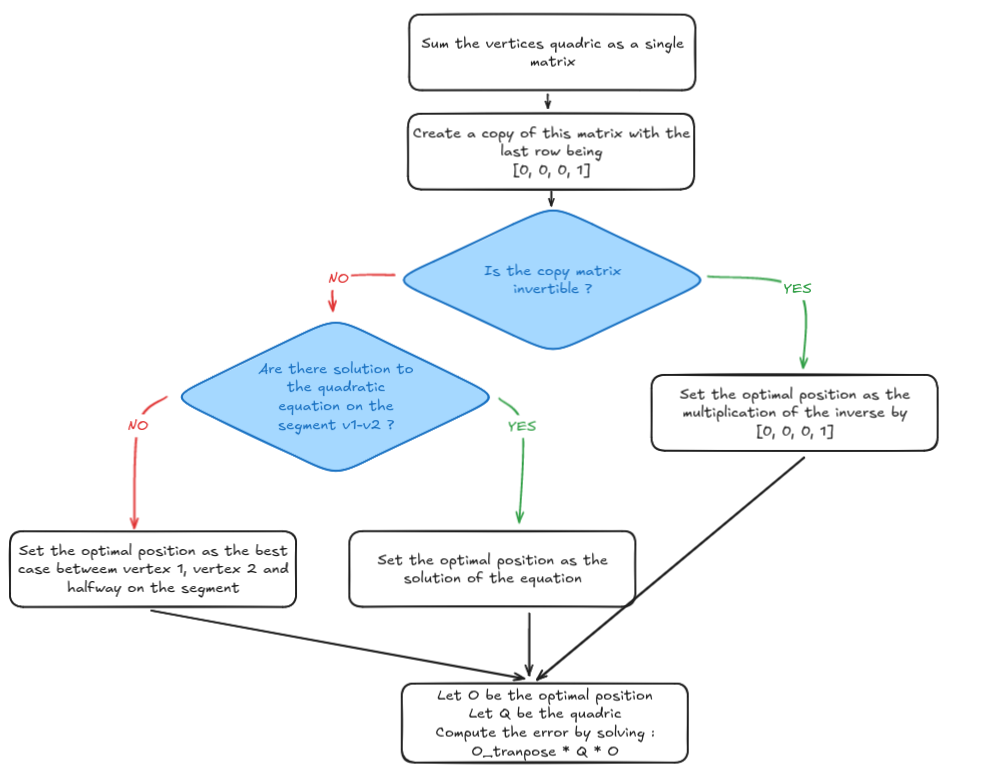
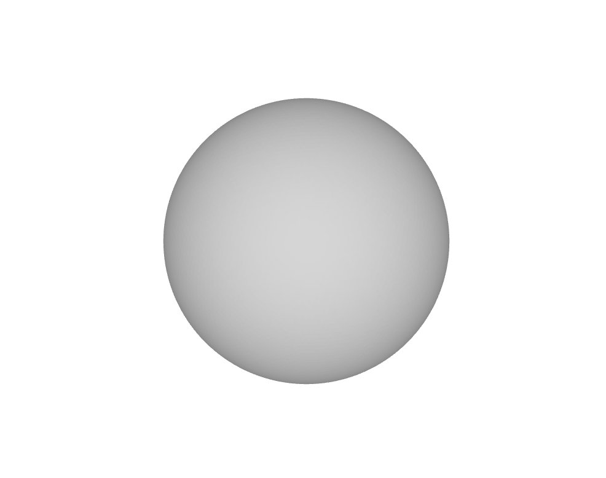
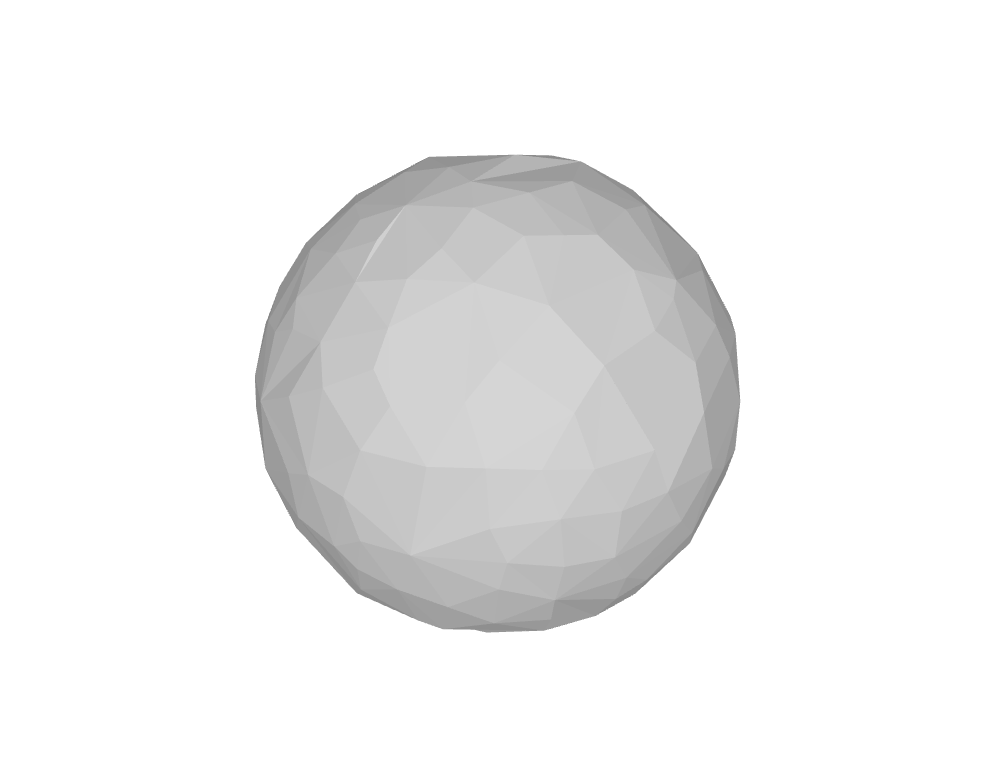
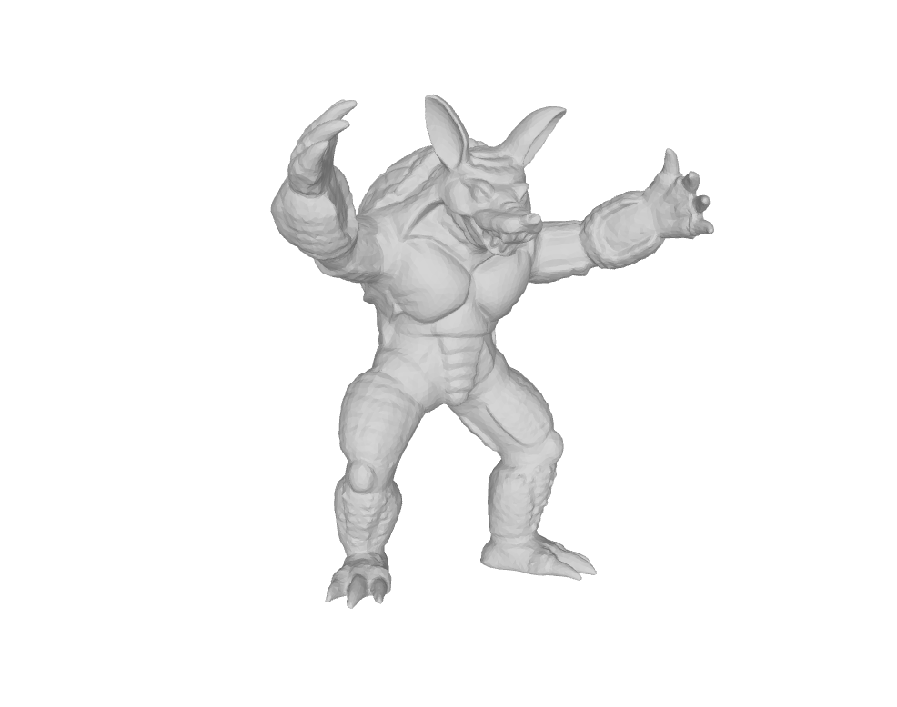
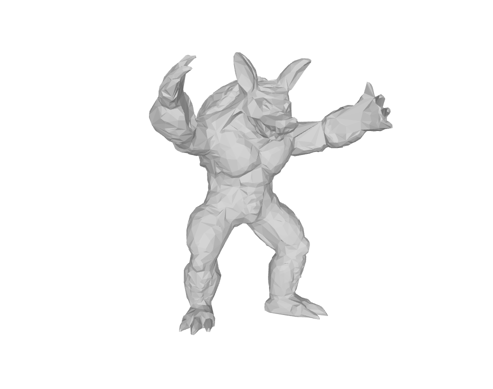
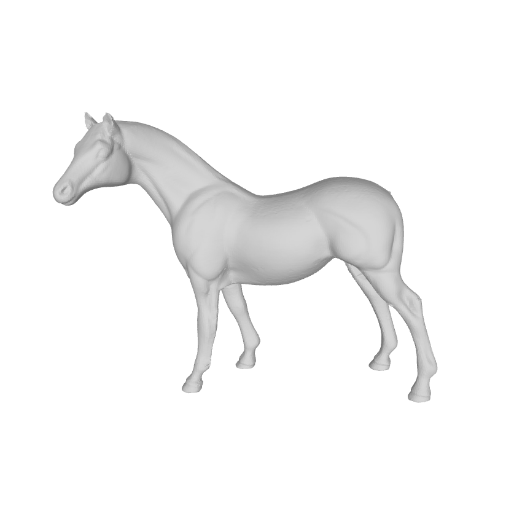
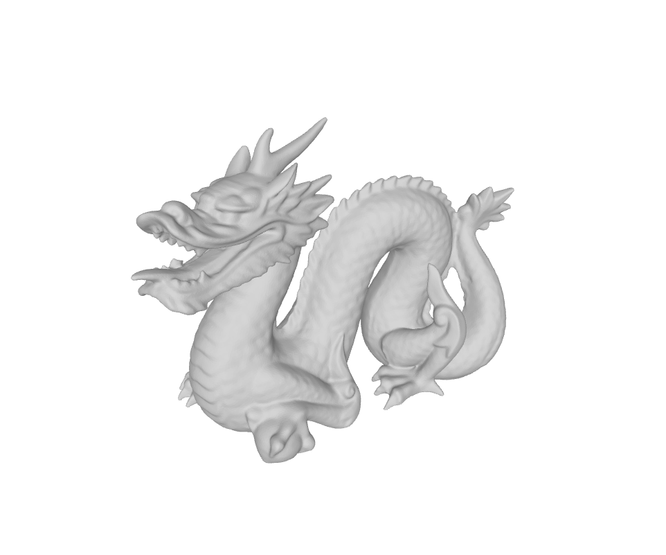
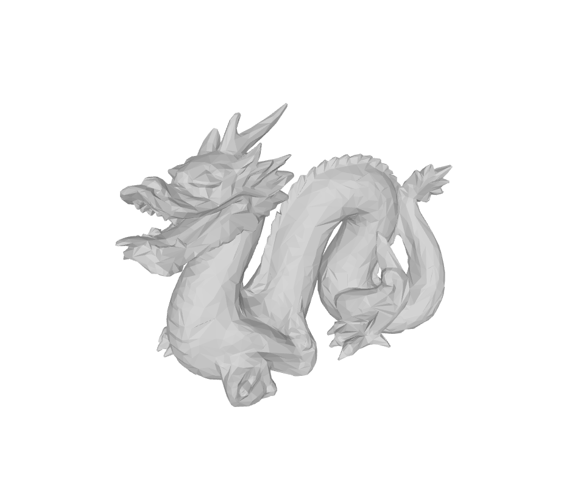

# QEM Algorithm - Mesh simplifier

## Introduction

The goal of this project was to implement the **quadratic error mesh simplification algorithm**.\
I chose to use **c++** for it because of its fast execution time.

**External libraries used** : Eigen Library (for matrices and vector operations)\
**Sources** : [original research paper](https://www.cs.cmu.edu/~./garland/Papers/quadrics.pdf), to learn the concepts of this algorithm and the maths formula used.

### Usage

```
# Compilation
./linux_build.sh

# Execution
./mesh-simplifier <path-to-source> <iterations> [path-of-destination]
```

**mesh-simplifier** : the executable.

**path-to-source** (string) : the path of the OBJ file.

**iterations** (unsigned int) : the number of iterations the program must execute (the number of vertices to be deleted).

**path-of-destination** (string) : the path where the simplified mesh file will be put. By default, the resulting file will be written as ./result.obj.

> Arguments between **<** and **>** operator are **mandatory**.\
> Arguments between **[** and **]** are **faculative** and have a default value.

## Directory structure

- **CMakeLists.txt**, used for compiling rules.
- **linux_build.sh**, that creates the build directory and executes the CMakeLists.txt mentionned above.
- **main.cpp**, containing the main function of the program.
- **test.cpp**, containing the main function of the unit tests.
- The **include** directory, where are present the class declaration, type definition and various includes.
- The **src** directory, in which are present the function and class member functions definition.

## Algorithm

The algorithm aims to finding the edge with the lowest associated error.
The error is computed by calculating the distance of the optimal collapse point to the plane of every adjacent triangle of the two vertices.\
In the code, the edges are stored as two different types in two different containers :

### Edge Data

```cpp
struct EdgeData
{
    double error;
    bool isValid = true;
};

```

The **EdgeData** class stores the *error* of the associated edge as well as a boolean *isValid* indicating if sais edge is outdated / deleted.\
Objects of this type are stored in a map in the **Mesh** class

```cpp
struct Mesh
{
    {...}
    std::unordered_map<unsigned int, std::unordered_map<unsigned int, EdgeData>> edgesMap;
    {...}
};
```

The keys of this map are the edge's vertices index, with the lowest vertex index being the first and the bigger being the second.\
For example, the edge 156-269 would be stored in the map as such :
```cpp
edgesMap[156][269] = EdgeData(error);
```
That way, you only need the vertices of an edge to find its error in the map with a way to intrinsically know which indexes to use.

### Edge Index

```cpp
struct EdgeIndex
{
    unsigned int v1;
    unsigned int v2;
    bool isValid = true;
};
```

The **EdgeIndex** class' main purpose is to store the vertices / keys of an edge to find it in the map.\
It is with this type that we interect when sorting and finding the lowest error's edge.\
They are stored in a set, sets having the advantage of automatically sorting and only containing once each element.

```cpp
std::set<EdgeIndex> sortedEdges;
```

### Edges error computation

As you may have noticed, the edge's optimal collapse position is not stored in both of the above classes.\
That is because we only need the optimal position of the edge we're about to collapse and that position is susceptible to change every iteration depending on if a nearby vertex changed position.

However, both the error and the optimal position are computed in the same class member function :
```cpp
void ComputeEdgeOptimalPosition(Eigen::Vector4d &optimal_position, EdgeIndex &edge, Mesh *mesh);
```

Here are the main steps of this function :\


On the diagram above, you can see that the quadric matrix of the edges are summed in the function and not stored in **EdgeData**, this way, if one of the two vertices change, I don't need to recompute both vertices matrix plus the edge's matrix, I only need to update the modified vertex as well as the edge's.

### Vertex data

Before going over how the program collapses an edge, let's take a look at the structure representing vertices and triangles.
```cpp
struct VertexData
{
    std::unordered_set<unsigned int> adjacentTriangles;
    std::unordered_set<unsigned int> adjacentVertices;
    Eigen::Matrix4d matrix;
    Eigen::Vector3d coordinates;
    bool isValid = true;
};
```
```cpp
struct TriangleData
{
    vec3<unsigned int> verticesIndex;
    Eigen::Vector4d plane;
    bool isValid = true;
};
```

The vertex structure stores a list of its adjacent triangles and vertices, as well as its quadric matrix and of course its coordinates.

The triangle structure contains the index of its vertices and a 4-dimension vector representing a, b, c and d in its plane equation.

Both structure also contain the same boolean as in the edge's structure, **isValid** indicating if the triangle / vertex is still active.

### Edge collapse procedure

Every iteration, if the first edge in the set of edges is not invalid, the program will initiate the list of actions allowing to collapse an edge.\
When collapsing an edge, it is that lowest vertex of the edge that gets updated and the biggest vertex that gets deleted. (In the edge 156-269, 156 will update its position and 269 will be declared as inactive).\
For the sake of clarity, let's call the smallest vertex index as **v1** and let's call the biggest vertex index **v2**.

Here is the order of the actions to be done :
- Compute the optimal position of the edge
- Change the value of v1 for this position
- Delete every triangle containing both v1 and v2
- Replace every occurence of v2 for v1 in adjancent triangles and vertices
- Recompute the quadric matrix of all adjacent vertices to both v1 an v2
- Finally deactive the vertex, delete it from the map and decrement the mesh's number of vertices.

All of this is made easy by keeping a list of adjacent triangles and vertices in the vertices structures. That way, we only need to compute what changed.

## Program architecture

The program is divided into three main classes :
- **OBJLoader** (src/Parser.cpp). The utility of this class is to load a 3d mesh stored in an obj file and fill in the data of a *Mesh* class.
- **QEMSimplifier** (src/QEMSimplifier.cpp). This class does all the simplification process.
- **OBJWriter** (src/Writer.cpp). This class allows to write the content of a mesh inside a file in OBJ file format.

## Results
|                            | Sphere | Armadillo | Horse  | Dragon  |
|----------------------------|--------|-----------|--------|---------|
| Mesh's number of vertices  | 10,242 | 23,201    | 48,485 | 104,855 |
| Number of deleted vertices | 10,000 | 20,000    | 45,000 | 100,000 |
| Time result                | 5.49s  | 11.6s     | 24.43s | 63.46   |

<div style="display: flex; flex-direction: row; justify-content: left; align-items: center;">
<figure style="text-align: center; margin: 0 10px;">

<figcaption>Sphere - 10,242 vertices</figcaption>
</figure>
<figure style="text-align: center; margin: 0 10px;">

<figcaption>Sphere - 242 vertices</figcaption>
</figure>
</div>

<div style="display: flex; flex-direction: row; justify-content: left; align-items: center;">
<figure style="text-align: center; margin: 0 10px;">

<figcaption>Armadillo - 23,201 vertices</figcaption>
</figure>
<figure style="text-align: center; margin: 0 10px;">

<figcaption>Armadillo - 3,201 vertices</figcaption>
</figure>
</div>

<div style="display: flex; flex-direction: row; justify-content: left; align-items: center;">
<figure style="text-align: center; margin: 0 10px;">

<figcaption>Horse - 48,485 vertices</figcaption>
</figure>
<figure style="text-align: center; margin: 0 10px;">

<figcaption>Horse - 3,485 vertices</figcaption>
</figure>
</div>

<div style="display: flex; flex-direction: row; justify-content: left; align-items: center;">
<figure style="text-align: center; margin: 0 10px;">

<figcaption>Dragon - 104,855 vertices</figcaption>
</figure>
<figure style="text-align: center; margin: 0 10px;">

<figcaption>Dragon - 4,855 vertices</figcaption>
</figure>
</div>
